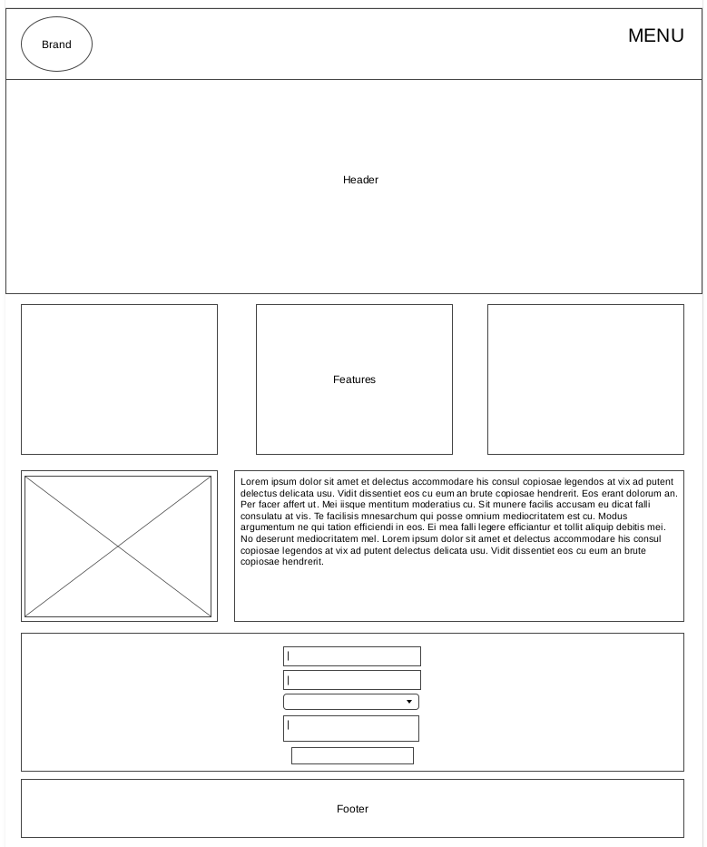
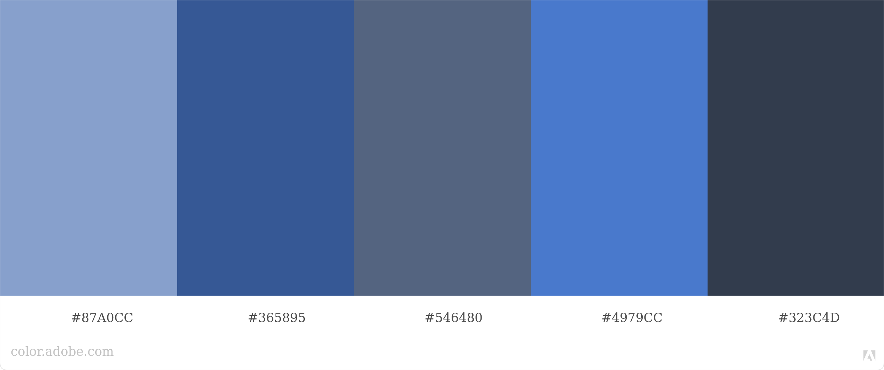

# Wireframe



LINK: https://wireframe.cc/1bNoOo

# Branding



LINK: https://color.adobe.com/create/color-wheel

## Branding css

```css
/* Color Theme Swatches in Hex */
.My-Color-Theme-1-hex { color: #87A0CC; }
.My-Color-Theme-2-hex { color: #365895; }
.My-Color-Theme-3-hex { color: #546480; }
.My-Color-Theme-4-hex { color: #4979CC; }
.My-Color-Theme-5-hex { color: #323C4D; }

/* Color Theme Swatches in RGBA */
.My-Color-Theme-1-rgba { color: rgba(135, 160, 204, 1); }
.My-Color-Theme-2-rgba { color: rgba(54, 88, 149, 1); }
.My-Color-Theme-3-rgba { color: rgba(84, 100, 128, 1); }
.My-Color-Theme-4-rgba { color: rgba(73, 121, 204, 1); }
.My-Color-Theme-5-rgba { color: rgba(50, 60, 77, 1); }

/* Color Theme Swatches in HSLA */
.My-Color-Theme-1-hsla { color: hsla(218, 40, 66, 1); }
.My-Color-Theme-2-hsla { color: hsla(218, 46, 39, 1); }
.My-Color-Theme-3-hsla { color: hsla(218, 20, 41, 1); }
.My-Color-Theme-4-hsla { color: hsla(218, 56, 54, 1); }
.My-Color-Theme-5-hsla { color: hsla(217, 21, 24, 1); }
```